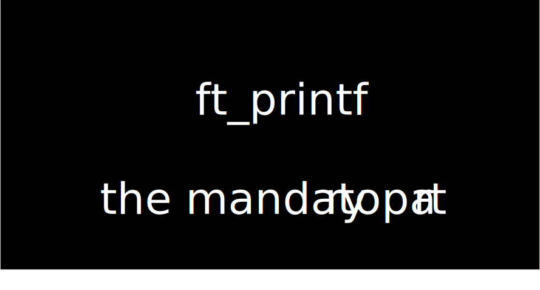

<p align="center">

</p>

<P align="center"> 
   This project is about programming a function that memics the functionality of the stadard function printf defined in the library <i>stdio.h</i>
</p>
  
  
# 👤INFO ABOUT THE PROJECT
```
PRINTF is a 42 Project that aims to mimic libc printf function

Basics, requested from subject:
* A) parsing for flags, field_width, precision, length_modifier.
* B) parsing for conversion specifier.
* C) displaying UTF-8 characters. (%C and %S).
* D) computing unsigned numbers in base16 (%x).
* E) displaying signed numbers (%d %D %i).
* F) displaying pointer address (%p).

```
You can read the project subject [here](https://github.com/RIDWANE-EL-FILALI/ft_printf/blob/master/printf.pdf)
  
  
# 🎁call it a gift
```
gcc *.c -fsanitize=address
```
# ⛓️tester link
  you can checkout this tester [here](https://github.com/Tripouille/libftTester)

  
# 💻Badge 

  
# 📚Skills
* Rigor
* Unix
* Algorithms & AI 
  
  
# 📱REACH ME

Made by RIDWANE EL FILALI 👋 [See my linkedin](https://www.linkedin.com/in/ridwane-elfilali-0ab7aa253/)
